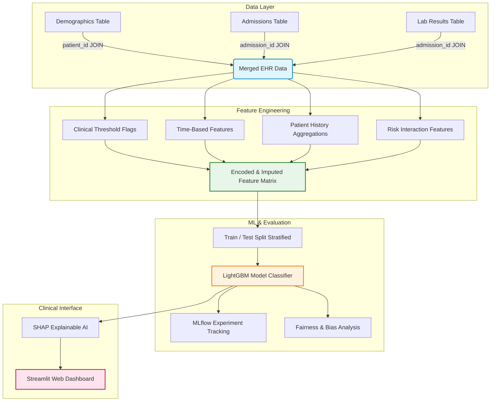

# 🏥 Project Explanation: Hospital Patient Readmission Predictor

Welcome to the comprehensive project guide for the **Hospital Patient Readmission Predictor**. This document provides an in-depth, beginner-friendly explanation of the clinical context, engineering choices, machine learning models, and validation frameworks used in this system.

---

## 📌 1. Project Overview & Clinical Context

In modern healthcare, **hospital readmissions** (a patient returning to the hospital within 30 days of discharge) are a major challenge. 
* **The Clinical Issue:** High readmission rates often indicate that a patient was discharged too early, had an unresolved complication, or suffered from inadequate post-discharge support.
* **The Financial Impact:** In India, each avoided readmission saves between **₹1.5 to ₹3 lakhs** in operational costs and insurance claims. Furthermore, reducing readmissions frees up critical hospital beds for other acute patients.
* **The Goal:** Build an intelligent decision-support system that predicts readmission risk *at the exact moment of discharge*, allowing clinical teams to schedule targeted home check-ins or medication counseling for high-risk patients.

---

## 🏗️ 2. Architectural Pipeline

The system is built on a modular data and machine learning pipeline, flowing from raw Electronic Health Record (EHR) data to an interactive clinic-facing dashboard.



---

## 📈 3. How the Model Evaluates Risk

Standard metrics can be deeply misleading when dealing with clinical data. Below is how and why our evaluation framework is constructed.

### The Problem with Accuracy
In our dataset, **18% of discharged patients are readmitted**, while **82% are not**. 
* If a model simply guesses `"No one will return"` for every single patient, it achieves a stellar **82% accuracy** while catching **0%** of high-risk cases.
* In medical machine learning, this is a dangerous failure. Therefore, we use metrics that are immune to this class imbalance.

### Key Metrics Defined

```mermaid
gantt
    title Classification Threshold and Trade-offs
    dateFormat X
    axisFormat %s

    section Low Threshold
    More Alerts / Higher Recall       :active, 0, 45
    More False Alarms / Low Precision  :crit, 45, 100

    section High Threshold
    Fewer Alerts / High Precision    :active, 0, 55
    Missed High-Risk Cases / Low Recall :crit, 55, 100
```



1. **ROC AUC (Area Under the Receiver Operating Characteristic curve)**
   * **Definition:** ROC AUC measures the model's ability to **rank** patients. 
   * **Interpretation:** A score of `0.5` represents random guessing (like flipping a coin). A score of `1.0` represents perfect prediction. An AUC of **`0.83`** means that if we select a random patient who was readmitted and a random patient who was not, there is an **83% probability** that the model will assign a higher risk score to the readmitted patient.
   * **Why it matters:** It lets hospitals rank patients from highest to lowest risk. Clinical managers can then allocate their care resources (e.g. nurse home visits) to the top 10% or 15% highest-risk individuals, regardless of the exact probability cutoff.

2. **Precision vs. Recall Trade-off**
   * **Recall (Sensitivity):** Out of all patients who *actually* got readmitted, what percentage did we catch? High recall means we rarely miss high-risk patients.
   * **Precision (Positive Predictive Value):** Out of all patients we *predicted* would return, what percentage actually did? High precision means we don't trigger false alarms.
   * **Clinical Balance:** We prioritize **Recall** in healthcare because missing an endangered patient is far more critical than wasting a follow-up call on a patient who turns out to be fine.

3. **Class Weight Balancing (`class_weight='balanced'`)**
   * By default, classifiers try to maximize overall accuracy, ignoring minority classes. By setting this flag in LightGBM, we penalize errors on readmitted patients ~4.5 times more heavily, forcing the model to learn the distinct patterns of the minority class.

---

## 🔬 4. Feature Selection: The "Why" and "Why Not"

Feature engineering is the process of using domain knowledge (in this case, medicine) to create variables that help a machine learning model make accurate decisions.

### 🟢 Features Chosen (Included)

| Feature | Category | Source Table | Clinical Rationale for Inclusion |
| :--- | :--- | :--- | :--- |
| **`age`** | Demographics | `patients` | Older age is strongly correlated with slower recovery and higher vulnerability to complications. |
| **`chronic_conditions`** | Demographics | `patients` | Patients with multi-morbidity (e.g., diabetes + heart failure) are highly complex and prone to rapid decompensation. |
| **`length_of_stay_days`** | Admissions | `admissions` | Longer hospital stays act as a direct proxy for the initial severity of the disease. |
| **`admission_type` (Emergency)** | Admissions | `admissions` | Unplanned, acute emergency admissions carry significantly higher readmission risks than planned elective procedures. |
| **`discharge_disposition`** | Admissions | `admissions` | Discharges to rehabilitation or nursing centers indicate that the patient is not fully stable or independent. |
| **`num_medications_discharge`** | Admissions | `admissions` | High pill counts (polypharmacy) increase the risks of side effects, drug interactions, and compliance confusion. |
| **Abnormal Lab Flags** (`abnormal_creatinine`, `anemia`, `hyperglycemia`, etc.) | Labs | `labs` | We engineered flags using clinical cutoffs (e.g., `creatinine > 1.5` indicates kidney distress; `hemoglobin < 10` indicates anemia). |
| **`total_abnormal_labs`** | Engineered | Combined | The sum of all abnormal labs represents overall physiological instability. |
| **`prior_admissions`** | History | Combined | Compiles historical frequency. Frequent flyers ("revolving door" patients) are statistically highly likely to return. |
| **`age_x_chronic`** | Interaction | Engineered | Multiplies age by chronic counts, representing the compounding risk of elderly patients suffering from multiple diseases. |

### 🔴 Features Excluded (or Dropped)

* **`patient_id` & `admission_id`:** These are database-generated keys. They hold no biological or physical meaning. If left in, a model would simply memorize specific patients, failing to generalize to new, unseen patients (overfitting).
* **Raw `admission_date`:** Tree-based models cannot interpret date formats (like `'2025-05-24'`). We discard the raw string and instead extract **`admission_month`** (capturing seasonal peaks) and **`is_weekend_admission`** ( weekend discharges often suffer from reduced clinic staffing, leading to poor post-op support).
* **`blood_group`:** Generates noise. A patient's blood type has no statistical correlation with 30-day readmissions across different diseases. Leaving it in would distract the model from true biological drivers.
* **Continuous Raw Lab Values:** Tree algorithms can split continuous values, but medical risk is often non-linear. For example, White Blood Cell (WBC) count is dangerous if it's too high (indicating infection) **or** too low (indicating weak immune system). By engineering `abnormal_wbc` (`WBC < 4` or `WBC > 11`), we explicitly embed this clinical guideline into the data, simplifying the model's job.

---

## 💻 5. Segment-by-Segment Code Explanation

Let's break down each block of the pipeline from the perspective of a beginner.

### Step 1: Synthetic EHR Data Generation
This step creates realistic, messy medical data containing tables for Demographics, Stays, and Laboratory results.

```python
fake = Faker('en_IN')
np.random.seed(42)
n_admissions = 8000
```
* **`Faker('en_IN')`**: A library that generates realistic, localized Indian demographics (such as names, addresses, and districts).
* **`np.random.seed(42)`**: Ensures that every time you run this code, it generates the *exact same* sequence of numbers. This ensures reproducibility.

```python
patients = pd.DataFrame({
    'patient_id': [f'P{i:05d}' for i in range(n_patients)],
    'age': np.random.randint(18, 90, n_patients),
    'gender': np.random.choice(['M', 'F', 'Other'], n_patients, p=[0.48, 0.50, 0.02]),
    ...
})
```
* **`pd.DataFrame`**: Creates a spreadsheet structure.
* **`np.random.choice`**: Chooses items from a list. The `p=[0.48, 0.50, 0.02]` parameter dictates the target percentage distribution (e.g., 48% male, 50% female, 2% other).

```python
admissions = pd.DataFrame({
    ...
    'length_of_stay_days': np.random.lognormal(1.2, 0.7, n_admissions).clip(1, 45).astype(int),
    'num_procedures': np.random.poisson(2, n_admissions),
    ...
})
```
* **`np.random.lognormal`**: Generates length of stay. Real hospital stays are skewed: most people leave in 1-3 days, but a few stay for weeks. Lognormal modeling replicates this clinical reality.
* **`.clip(1, 45)`**: Limits the output values to a realistic range (minimum 1 day, maximum 45 days).
* **`np.random.poisson`**: Generates integers centered around an average (e.g., an average of 2 procedures per visit).

```python
# Add ~8% missing lab values
for col in ['hemoglobin', 'creatinine', 'glucose_random']:
    labs.loc[np.random.random(n_admissions) < 0.08, col] = np.nan
```
* **`np.nan`**: Represents missing data. In real healthcare databases, lab tests can fail or go unrecorded. We simulate this by setting 8% of hemoglobin, creatinine, and glucose entries to empty values.

```python
# Merge & Create Target
df = admissions.merge(patients, on='patient_id').merge(labs, on='admission_id')
```
* **`merge`**: Performs database-style JOIN operations. We link patient profiles to their admissions using `patient_id`, then link lab results using `admission_id`.

```python
readmit_score = (
    (df['age'] > 65).astype(float) * 1.5 +
    (df['chronic_conditions'] >= 2).astype(float) * 2 +
    ...
    np.random.normal(0, 2, n_admissions)
)
df['readmitted_30_days'] = (readmit_score > 5).astype(int)
```
* **`readmit_score`**: An additive risk formula based on clinical factors.
* **`np.random.normal(0, 2)`**: Adds a Gaussian bell-curve of random noise. If data has perfect mathematical rules, models overfit. Noise mimics realistic real-world medical unpredictability.
* **`.astype(int)`**: Converts a True/False decision into a binary category (`1` for readmitted, `0` for safe).

---

### Step 2: SQL — Multi-Table Clinical Queries
This block models database transactions for clinical analysis.

```python
import sqlite3
conn = sqlite3.connect('data/hospital.db')
patients.to_sql('patients', conn, if_exists='replace', index=False)
```
* **`sqlite3.connect`**: Opens a local SQL database file.
* **`to_sql`**: Converts pandas DataFrames into SQL database tables.

```sql
SELECT p.district, p.insurance_type,
       COUNT(a.admission_id) AS total_admissions,
       ROUND(AVG(a.length_of_stay_days), 1) AS avg_los,
       a.department,
       ROUND(AVG(l.creatinine), 2) AS avg_creatinine
FROM admissions a
JOIN patients p ON a.patient_id = p.patient_id
JOIN labs l ON a.admission_id = l.admission_id
WHERE a.admission_type = 'emergency'
GROUP BY p.district, p.insurance_type, a.department
HAVING COUNT(a.admission_id) > 10
ORDER BY avg_los DESC
LIMIT 15
```
* **`JOIN`**: Glues tables together.
* **`WHERE`**: Filters out non-emergency cases.
* **`GROUP BY`**: Bundles metrics across location, funding, and clinical department.
* **`HAVING`**: Excludes small groups (less than 10 patients) to ensure statistical relevance.

---

### Step 3: Feature Engineering Pipeline
Prepares our clinical parameters into clean mathematical inputs.

```python
df['admission_month'] = pd.to_datetime(df['admission_date']).dt.month
df['is_weekend_admission'] = pd.to_datetime(df['admission_date']).dt.dayofweek >= 5
```
* **`dt.month` & `dt.dayofweek`**: Extracts numeric representation of dates (month 1-12, day 0-6).

```python
df['abnormal_creatinine'] = (df['creatinine'] > 1.5).astype(int)
df['abnormal_wbc'] = ((df['wbc_count'] < 4) | (df['wbc_count'] > 11)).astype(int)
```
* Uses clinical cutoff values to create binary flag variables (e.g. `1` if abnormal, `0` if normal).

```python
patient_history = df.groupby('patient_id').agg(
    prior_admissions=('admission_id', 'count'),
    avg_prior_los=('length_of_stay_days', 'mean'),
    max_prior_medications=('num_medications_discharge', 'max'),
).reset_index()
df = df.merge(patient_history, on='patient_id', suffixes=('', '_hist'))
```
* Aggregates longitudinal patient profiles. If a patient is seen multiple times in the records, it computes their aggregate historical length of stay and prior visit frequency.

```python
for col in cat_cols:
    df[col] = LabelEncoder().fit_transform(df[col])
```
* **`LabelEncoder`**: Converts text columns like `'general_medicine'`, `'neurology'` to numbers (`0`, `1`, `2`) because computers only process numerical values.

---

### Step 4: LightGBM with MLflow Tracking
Trains our tree ensemble and logs performance.

```python
imputer = SimpleImputer(strategy='median')
X_imputed = pd.DataFrame(imputer.fit_transform(X), columns=X.columns)
```
* **`SimpleImputer`**: Locates empty values (which we added in Step 1) and replaces them with the median value of that feature column.

```python
X_train, X_test, y_train, y_test = train_test_split(
    X_imputed, y, test_size=0.2, random_state=42, stratify=y)
```
* **`test_size=0.2`**: Keeps 20% of data hidden in a vault. We train our model on 80%, then test its accuracy on the hidden 20% to verify real-world performance.
* **`stratify=y`**: Ensures the test vault has the exact same 18% readmission split as the training block.

```python
params_list = [
    {'n_estimators': 200, 'max_depth': 5, 'learning_rate': 0.1, 'num_leaves': 31},
    ...
]
```
* **Hyperparameters**: Configurations controlling tree generation. We try three distinct sets to see which performs best.

```python
with mlflow.start_run(run_name=f"lgbm_run_{i+1}"):
    model = lgb.LGBMClassifier(
        **params, random_state=42, class_weight='balanced',
        verbose=-1, metric='auc'
    )
```
* **`mlflow.start_run`**: Tells MLflow to record our model metrics, hyperparameters, and resulting charts automatically.
* **`lgb.LGBMClassifier`**: High-performance tree-boosting classifier.
* **`class_weight='balanced'`**: Forces the algorithm to penalize errors in predicting readmitted cases heavier, solving our class imbalance problem.

```python
    model.fit(X_train, y_train,
              eval_set=[(X_test, y_test)],
              callbacks=[lgb.early_stopping(50), lgb.log_evaluation(0)])
```
* **`fit`**: Starts the training loop.
* **`early_stopping(50)`**: Tells the trainer: *"If the test score does not improve for 50 trees, halt training immediately."* This prevents overfitting.

---

### Step 5: Fairness Analysis
A clinical check to ensure that the model doesn't behave with bias toward patient groups.

```python
for gender_val in df_test['gender'].unique():
    subset = df_test[df_test['gender'] == gender_val]
    if len(subset) > 50:
        auc = roc_auc_score(subset['y_true'], subset['y_proba'])
        fpr = (subset['y_pred'].sum() - (subset['y_true'] & subset['y_pred']).sum()) / (~subset['y_true'].astype(bool)).sum()
```
* Splits the predictions by demographic subgroups (gender, insurance tier, age cohort).
* Calculates **`auc`** and **`fpr`** (False Positive Rate) for each group independently.
* **Why?** If the False Positive Rate for female patients is significantly higher than for males, female patients will experience more false alarms. Monitoring this ensures equal distribution of care resources.

---

### Step 6: SHAP + Streamlit Clinical Dashboard
Renders a dashboard for doctors, explaining predictions in real-time.

```python
model = joblib.load('models/readmission_lgbm.pkl')
explainer = shap.TreeExplainer(model)
```
* **`joblib.load`**: Imports our saved model back into memory.
* **`shap.TreeExplainer`**: A game-theory framework that breaks down predictions. It reveals the positive or negative contribution of each feature to the final risk score.

```python
with st.form("patient_form"):
    col1, col2, col3 = st.columns(3)
    with col1:
        age = st.number_input("Age", 18, 90, 65)
        chronic = st.selectbox("Chronic Conditions", [0, 1, 2, 3, 4])
...
submitted = st.form_submit_button("Calculate Risk", type="primary")
```
* **`st.columns` & `st.number_input`**: Render a clean layout with forms directly inside the web browser.
* **`st.form_submit_button`**: Triggers model execution and displays the interactive risk scores with SHAP charts upon user submission.

---

## ⚖️ 6. Fairness & Bias Metrics Explanation

When audit results are printed, here is what they mean:

* **AUC by Subgroup:** Measures how reliable the model's ranking is for that specific demographic. A gap in AUC (e.g., `Male AUC = 0.84`, `Female AUC = 0.72`) shows the model has not learned features equally well for both sexes, usually requiring better representative data.
* **FPR (False Positive Rate):**
  $$\text{FPR} = \frac{\text{False Positives (Predicted readmitted, but stayed home)}}{\text{Total Actual Negatives (Stayed home)}}$$
  * An elevated FPR for one group (e.g. self-pay patients) means they are systematically mislabeled as "high risk" more frequently than insured patients, which can lead to inefficient allocations of care resources.

---

## 🔍 7. Explainable AI: What is SHAP?

In medicine, a model cannot simply say: *"This patient has an 82% risk"* without explaining **why**. A doctor must trust the decision before acting.

* **SHAP (Shapley Additive exPlanations):** Based on cooperative game theory, it distributes "payouts" (contributions to the risk prediction) to each player (clinical feature).
* If the base readmission rate is **18%**, and this patient gets a predicted risk of **45%**:
  * SHAP identifies exactly which features pushed the risk up (e.g., Age 78 added **+15%**, Abnormal Kidney Lab added **+20%**).
  * It also shows which factors pulled the risk down (e.g., Elective admission pulled it down **-8%**).
  * This is visualized using waterfall or force plots, giving clinical staff an immediate explanation of the risk profile.

---
*Created as a project companion for Project 3: Hospital Patient Readmission Predictor.*
