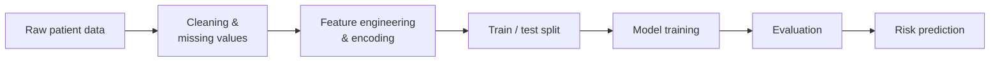

<p align="center">
  
</p>

<p align="center">
  
  
  
  
</p>

# 🏥 Hospital Patient Readmission Predictor

A machine-learning model that estimates the risk that a patient will be **readmitted to hospital after discharge**, so care teams can prioritise follow-up for the patients who need it most.

📄 **Full write-up:** [Project Explanation](./Project_Explanation.md)

---

## 🎯 Why this matters

Unplanned readmissions are costly for hospitals and often signal gaps in discharge planning or follow-up care. Flagging high-risk patients **before** they leave lets clinicians intervene early — a follow-up call, a medication review, or a scheduled outpatient visit.

## 📊 Dataset

| Item | Detail |
|---|---|
| Source | `<!-- e.g. UCI Diabetes 130-US Hospitals dataset -->` |
| Records | `<!-- number of patient encounters -->` |
| Target | `readmitted` — `<!-- e.g. within 30 days (yes / no) -->` |
| Key features | `<!-- e.g. age, time in hospital, lab procedures, medications, prior inpatient visits, diagnoses -->` |

## 🔄 Approach



1. **Data cleaning** — handle missing values, remove duplicates and invalid records.
2. **Feature engineering** — encode categorical variables, group diagnosis codes, derive visit-history features.
3. **Class imbalance** — `<!-- e.g. SMOTE / class weights / none -->`
4. **Modelling** — `<!-- e.g. Logistic Regression, Random Forest, XGBoost -->`
5. **Evaluation** — compared on held-out data, prioritising **recall** so that fewer at-risk patients are missed.

## 📈 Results

| Model | Accuracy | Precision | Recall | F1 | ROC-AUC |
|---|---|---|---|---|---|
| `<!-- model 1 -->` | – | – | – | – | – |
| `<!-- model 2 -->` | – | – | – | – | – |
| **`<!-- best model -->`** | – | – | – | – | – |

**Top risk drivers:** `<!-- e.g. number of prior inpatient visits, time in hospital, number of medications -->`

## 🛠️ Tech stack

`Python` · `pandas` · `NumPy` · `scikit-learn` · `Matplotlib / Seaborn` · `<!-- add: XGBoost / Streamlit / Jupyter -->`

## 🚀 How to run

```bash
git clone https://github.com/Sabyasachi-Sahu/Hospital-Patient-Readmission-Predictor.git
cd Hospital-Patient-Readmission-Predictor
pip install -r requirements.txt
# then run the notebook or script, e.g.
# jupyter notebook
```

## 📁 Repository structure

```
.
├── README.md
├── Project Explanation: Hospital Patient Readmission Predictor.md
└── assets/
    └── banner.png
```

## ⚠️ Limitations

- Trained on historical data; performance on a specific hospital's population needs local validation.
- A risk score supports clinical judgement — it does not replace it.

## 🔮 Future work

- Add model explainability (e.g. SHAP) for patient-level reasons behind each score
- Deploy as an interactive app for care teams
- Validate on more recent and more diverse patient data

## 👤 Author

**Sabyasachi Sahu** — Senior Data Scientist
[GitHub](https://github.com/Sabyasachi-Sahu)
