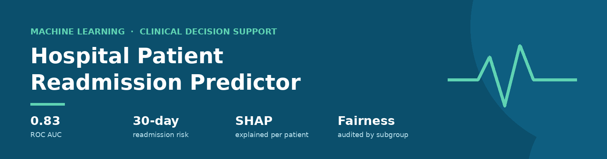
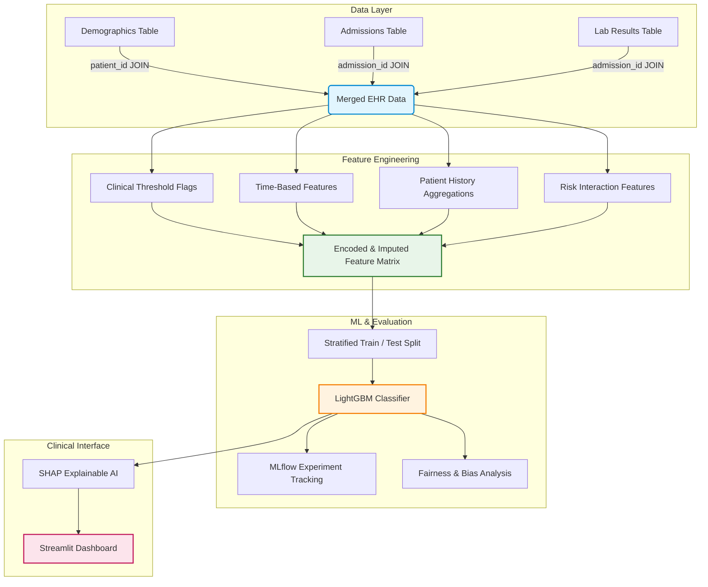

<p align="center">
  
</p>

<p align="center">
  
  
  
  
  
  
  
</p>

# 🏥 Hospital Patient Readmission Predictor

An end-to-end **clinical decision-support system** that predicts, *at the moment of discharge*, whether a patient is likely to be readmitted within **30 days** — and explains **why**, so care teams can target home check-ins and medication counselling where they matter most.

📄 **Deep-dive guide:** [Project Explanation](./Project%20Explanation%3A%20Hospital%20Patient%20Readmission%20Predictor.md) — a beginner-friendly walkthrough of the clinical context, every feature choice and every code block.

---

## 📌 Why it matters

| | |
|---|---|
| 🩺 **Clinical** | High readmission rates signal early discharge, unresolved complications or weak post-discharge support. |
| 💰 **Financial** | In India, each avoided readmission saves roughly **₹1.5–3 lakh** in operational costs and insurance claims. |
| 🛏️ **Capacity** | Fewer readmissions free beds for other acute patients. |

## ✨ Highlights

- **Multi-table EHR pipeline** — demographics, admissions and lab results joined in SQL and pandas
- **Clinically-informed features** — lab cutoffs (e.g. creatinine > 1.5, haemoglobin < 10), patient history, interaction terms
- **Imbalance-aware LightGBM** — `class_weight='balanced'` penalises missed readmissions ~4.5× more
- **Experiment tracking** with MLflow across three hyperparameter configurations, with early stopping
- **Fairness audit** — AUC and false-positive rate compared across gender, insurance tier and age cohort
- **Explainable AI** — SHAP shows which factors raised or lowered each patient's risk
- **Clinic-facing Streamlit dashboard** — enter patient details, get a risk score and its explanation

## 🏗️ Architecture



## 📊 Data

Synthetic but deliberately *messy* EHR data, generated to mirror real hospital records.

| Item | Detail |
|---|---|
| Records | **8,000 admissions** across demographics, admissions and lab tables |
| Locale | Indian demographics via `Faker('en_IN')` |
| Target | `readmitted_30_days` — 1 if readmitted within 30 days |
| Class balance | **18% readmitted / 82% not** |
| Realism | Log-normal length of stay (1–45 days), Poisson procedure counts, **~8% missing lab values**, Gaussian noise in the outcome |
| Reproducibility | `np.random.seed(42)` |

## 🔬 Features

**Included**

| Feature | Rationale |
|---|---|
| `age` | Older patients recover more slowly and face more complications |
| `chronic_conditions` | Multi-morbidity drives rapid decompensation |
| `length_of_stay_days` | Proxy for initial illness severity |
| `admission_type` (emergency) | Unplanned admissions carry higher risk than elective ones |
| `discharge_disposition` | Discharge to rehab or nursing care signals incomplete recovery |
| `num_medications_discharge` | Polypharmacy raises side-effect and compliance risk |
| Abnormal lab flags | Clinical cutoffs, e.g. `abnormal_wbc` = WBC < 4 **or** > 11 |
| `total_abnormal_labs` | Overall physiological instability |
| `prior_admissions` | "Revolving-door" patients are likely to return |
| `age_x_chronic` | Compounding risk of elderly, multi-morbid patients |
| `admission_month`, `is_weekend_admission` | Seasonal peaks; reduced weekend staffing |

**Deliberately excluded**

- `patient_id`, `admission_id` — database keys; would let the model memorise patients
- Raw `admission_date` — replaced by month and weekend features
- `blood_group` — no relationship to readmission; adds noise
- Raw lab values — replaced by clinical-threshold flags, because risk is non-linear (both high and low WBC are dangerous)

## 📈 Evaluation — why not accuracy?

A model that predicts *"no one returns"* scores **82% accuracy** while catching **0%** of at-risk patients. So this project evaluates on:

| Metric | What it tells us |
|---|---|
| **ROC AUC = 0.83** | Pick one readmitted and one non-readmitted patient at random: 83% of the time, the model ranks the readmitted one higher. Lets a hospital direct resources to its top 10–15% highest-risk patients. |
| **Recall** | Share of actual readmissions caught — **prioritised**, because missing an at-risk patient costs more than an extra follow-up call |
| **Precision** | Share of flagged patients who actually return — keeps false alarms in check |

Validation uses a **stratified 80/20 split** that preserves the 18% readmission rate in both sets, and **early stopping after 50 rounds** without improvement.

## ⚖️ Fairness & explainability

- **Subgroup audit** — AUC and false-positive rate computed separately by gender, insurance tier and age cohort. A gap means one group is ranked less reliably or flagged falsely more often, which would skew who receives care.
- **SHAP** — for a patient at 45% risk against an 18% baseline, SHAP shows what moved it, e.g. age 78 **+15%**, abnormal kidney lab **+20%**, elective admission **−8%**, shown as waterfall or force plots.

## 🛠️ Tech stack

`Python` · `pandas` · `NumPy` · `Faker` · `SQLite` · `scikit-learn` · `LightGBM` · `MLflow` · `SHAP` · `Streamlit` · `joblib`

## 🚀 Getting started

```bash
git clone https://github.com/Sabyasachi-Sahu/Hospital-Patient-Readmission-Predictor.git
cd Hospital-Patient-Readmission-Predictor
pip install pandas numpy faker scikit-learn lightgbm mlflow shap streamlit joblib

# run the pipeline (data generation → SQL → features → training), then:
mlflow ui                  # compare experiment runs at http://localhost:5000
streamlit run <app>.py     # launch the clinical dashboard
```

> Replace `<app>.py` with your Streamlit file name. The pipeline writes `data/hospital.db` and `models/readmission_lgbm.pkl`.

## 🔄 Pipeline at a glance

| Step | What happens |
|---|---|
| 1. Synthetic EHR generation | Three linked tables with realistic distributions, missing labs and noisy outcomes |
| 2. SQL clinical queries | Tables loaded into SQLite; emergency-admission analysis by district, insurance and department |
| 3. Feature engineering | Date features, clinical flags, patient-history aggregation, label encoding |
| 4. LightGBM + MLflow | Median imputation, stratified split, three tuned runs, balanced class weights, early stopping |
| 5. Fairness analysis | Per-subgroup AUC and false-positive rate |
| 6. SHAP + Streamlit | Saved model loaded, explained per patient, served through an interactive form |

## ⚠️ Limitations

- Trained on **synthetic** data — real deployment needs validation on actual hospital records.
- A risk score supports clinical judgement; it does not replace it.

## 🔮 Future work

- Validate on real, de-identified EHR data
- Calibrate probabilities and tune the alert threshold with clinicians
- Containerise and deploy the dashboard; monitor drift and fairness over time

## 👤 Author

**Sabyasachi Sahu** — Senior Data Scientist · [GitHub](https://github.com/Sabyasachi-Sahu)
